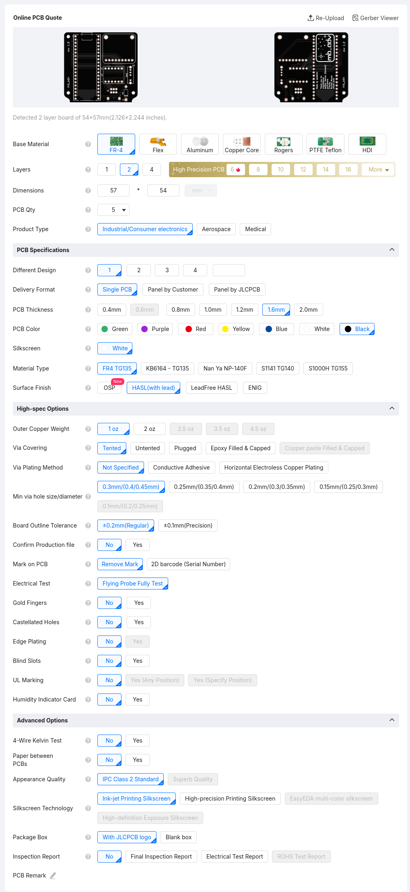
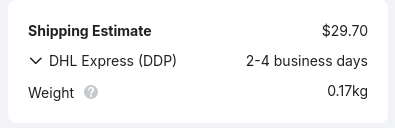

# Manufacturing
### This is done at your own risk. I am neither suggesting nor recommending that you do this.
### These instructions do not contain any affiliate links.
1. Download GERBERS.zip
2. Go to your PCB fabricator of choice (i.e. [JLCPCB](https://cart.jlcpcb.com/quote)) and order however many PCBs you wish to make using the following settings:

3. Choose your preferred shipping option by clicking the down arrow
> Note: JLCPCB uses ~$30 USD shippping by default. Global Standard Direct Line costs ~$7 USD and there haven't been any reports of people actually being charged the tariff in the US to my knowledge.

3.5. If you don't have access to a 3D printer, you may want to jump to step 7. Most PCB fabricators also offer 3D printing services.

4. Place your PCB (and optionally 3D printed case) order.

5. Order the following components (one per mb_adv):

|Name|Part #|Link|Notes|
|---|---|---|---|
|Raspberry Pi Pico|N/A|[4MB](https://www.aliexpress.us/item/3256808040042288.html)|Any 2MB+ Pico (including clones) which follows the official footprint is compatible with the PCB, but the buttons may not line up with the 3d printed case contained in this repo.|
|Through Hole Diode|1N5819|[DigiKey](https://www.digikey.com/short/rqfn3zbq)|Link will automatically add 1N5819, OS103011MS8QP1, 12009, and 4682 to your DigiKey cart|
|SP3T Switch|OS103011MS8QP1|[DigiKey](https://www.digikey.com/short/rqfn3zbq)|Link will automatically add 1N5819, OS103011MS8QP1, 12009, and 4682 to your DigiKey cart|
|Logic Level Shifter|12009|[DigiKey](https://www.digikey.com/short/rqfn3zbq)|Link will automatically add 1N5819, OS103011MS8QP1, 12009, and 4682 to your DigiKey cart|
|MicroSD SPI|4682|[DigiKey](https://www.digikey.com/short/rqfn3zbq)|Link will automatically add 1N5819, OS103011MS8QP1, 12009, and 4682 to your DigiKey cart|
|GBA Male Link Port|N/A|[Alibaba](https://www.alibaba.com/product-detail/6Pin-90-Degree-Curved-Feet-Male_1601634644553.html)|N/A|

6. Once everything arrives, solder the components onto the PCB.
> Note: If you are not comfortable soldering, you can bring the components, PCB, and a this guide to your local electronics repair shop and they could probably do it for you.

7. 3D print the case (link will be added once it has been designed)