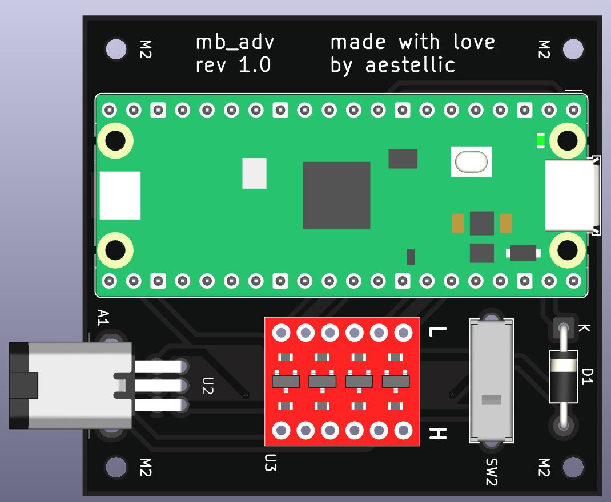
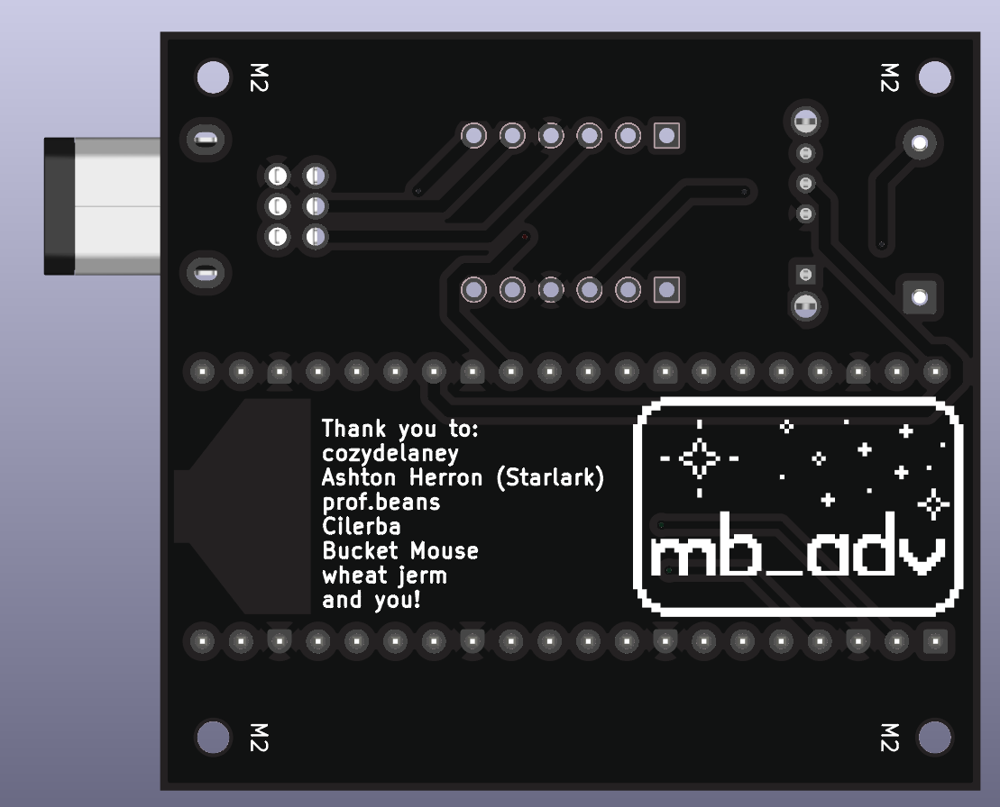

# 

> [!WARNING]
> This project (and its associated firmware) is a work-in-progress and is currently incomplete.

The mb_adv is a dongle for your GBA which injects multiboot ROMs via link cable.

With it, you can do stuff like [shiny hunt Jirachi without being tethered to a Gamecube](https://bsky.app/profile/cozydelaney.standingintheodds.com/post/3mt42ccd4bk23), boot [Poké Transporter GB](https://github.com/Striaton-Lab-Team/Poke_Transporter_GB), and even [connect your GBA to the internet](https://gblink.io/)!

 

If you'd like to buy one and are located in the USA, you can visit my store here (link will be added when store goes live). Otherwise, please see [MANUFACTURING.md](MANUFACTURING.md) for how to build one yourself!

# Usage
W.I.P

# F.A.Q.
How does this differ from the GB-Link?

- While the GB-Link needs to be connected to a computer/phone to work, the mb_adv draws power directly from the GBA. This lets the mb_adv work without plugging into any external devices!

What does mb_adv stand for?

- It stands for multiboot advance.

What the heck is a multiboot?

- It's a small GBA program that can be sent over the link cable. This is the same system that multiplayer games which only required one cartridge use. It's also used for a lot of Pokémon distributions!

How did you make this?

# Credits
This project would not have been possible without the following people:
- [cozydelaney](https://bsky.app/profile/cozydelaney.standingintheodds.com), who designed the logo and provided so much emotional support <3
- [Ashton Herron (Starlark)](https://github.com/starlarkus), who guided me through the planning stages of the mb_adv.
- [prof.beans](https://www.thebeanlabs.com/), who designed the enclosure for the mb_adv.
- [Bucket Mouse](https://github.com/MouseBiteLabs), who helped with choosing components and designing the schematic and PCB.
- wheat jerm, who helped with designing the schematic and PCB.
- [The GB-Link Team](https://gblink.io/), who created the incredible GB-Link and [GB-Link firmware](https://github.com/GB-Link/GBLink-Firmware).
- [loopj](https://github.com/loopj/gba-link-port), who created the footprint and 3D model for the male GBA link cable connector.
- [zaksabeast](https://github.com/zaksabeast/Portable-Pico-Multibooter), who served as the inspiration and foundation for this project
> Note: the mb_adv is not endorsed by zaksabeast in any way, shape, or form.

# License
This project is fully open sourced under the [MIT license](LICENSE).

# Technical References
See [MANUFACTURING.md](MANUFACTURING.md) and [SCHEMATIC.pdf](SCHEMATIC.pdf)
